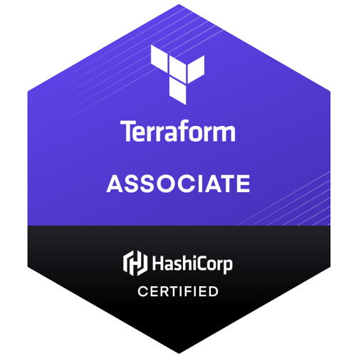

<!-- <h1 align="center">Hi , I'm Leonardo</h1> -->
<h1 align="center">Hi 👋, I'm Leonardo</h1>
<h3 align="center">Software Engineer</h3>

<p align='center'>
<a href="https://dev.to/leozz37"></a>&nbsp;&nbsp;
<a href="https://www.linkedin.com/in/leonardoaugustolima/"></a>&nbsp;&nbsp;
<a href="https://twitter.com/Leozzils"></a>&nbsp;&nbsp;
<a href="https://stackoverflow.com/users/12252869/leonardo-lima"></a>&nbsp;&nbsp;
<!-- <a href="https://www.instagram.com/leo.cpp/?hl=pt-br"></a>&nbsp;&nbsp; -->
<!-- <a href="https://open.spotify.com/user/leozzils?si=OqyBabsEQTKYZDxEy0MoFQ"></a>&nbsp;&nbsp; -->
<a href="https://medium.com/@leonardoaugusto287"></a>&nbsp;&nbsp;
</p>

I'm a 22 years old backend developer focused on C++, Python, Rust and Golang. Cloud and chaos engineering enthusiast. Feel free to contact me on my social medias!

  ---


```shell
$ npx leonardolima
```

  ---


[](https://github.com/leozz37?tab=repositories)

<!--  -->


### Curiosities

🇧🇷 Living in [Curitiba](https://www.google.com/maps/place/Curitiba,+PR/@-25.4950501,-49.4298839,11z/data=!3m1!4b1!4m5!3m4!1s0x94dce35351cdb3dd:0x6d2f6ba5bacbe809!8m2!3d-25.4289541!4d-49.267137), Brazil

🎓 Computer Engineering @ [Universidade Positivo](https://en.wikipedia.org/wiki/Universidade_Positivo)

🏢 Software Engineer @ [iFood](https://www.ifood.com.br/mercado?gclid=CjwKCAiA1aiMBhAUEiwACw25MdUlrNsAn0pRbA2RyztZPply8VtMm7RL9WGhlR3_4hAj2aHuGi1t1xoCGF0QAvD_BwE)

📚 Check my [programming books](https://github.com/leozz37/books) recomendation

👨‍💻 Check some of my projects using modern tools [here](https://github.com/leozz37/leozz37/blob/master/PROJECTS.md).


<br />

  ---

### Languages and Tools


<br /><br />


<br clear="all" />

  ---

### Certifications


